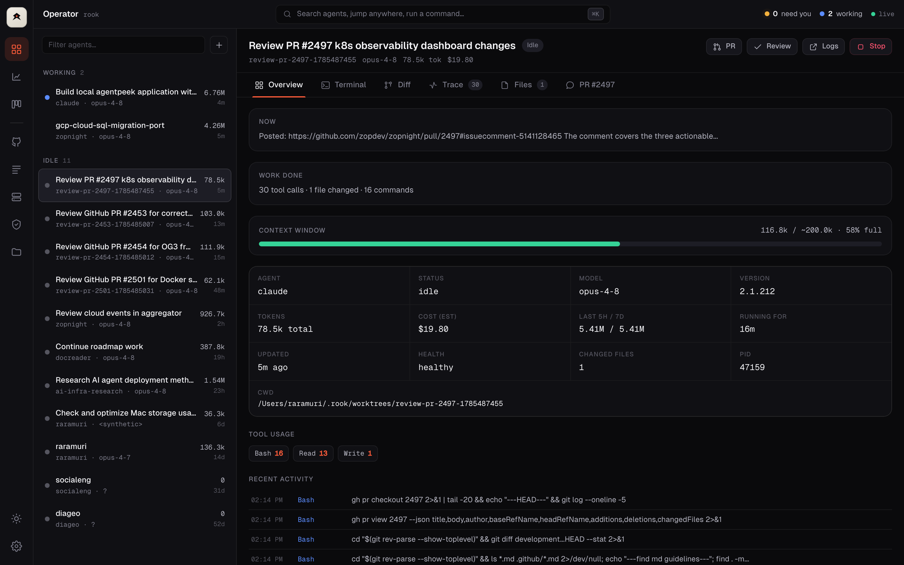
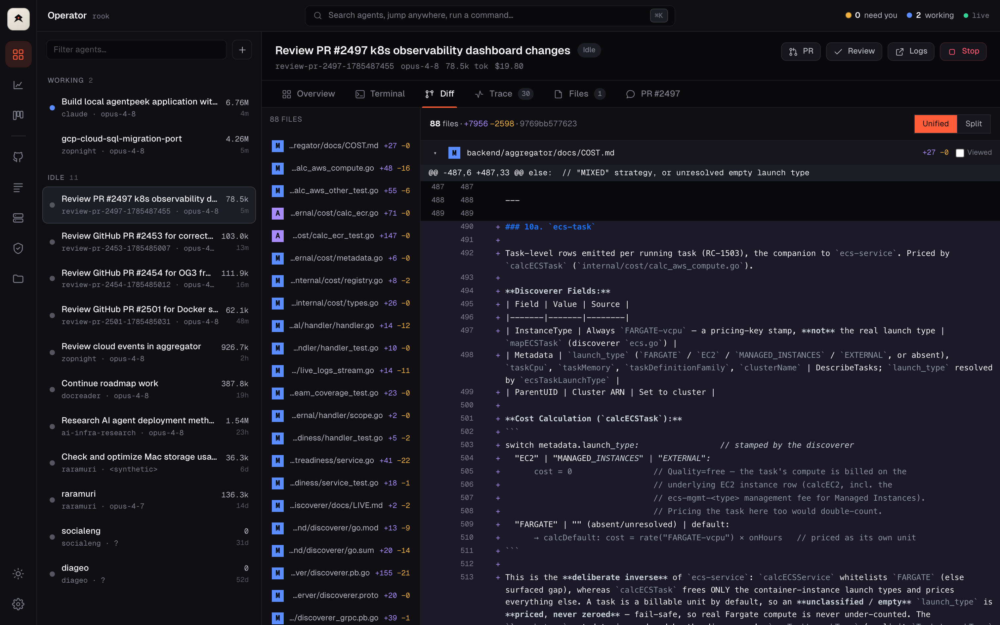
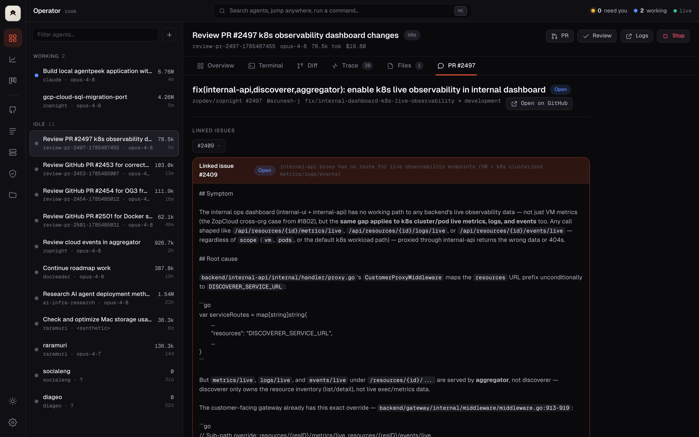

<div align="center">

# ♜ rook

### A local mission-control for your AI coding agents

Watch, drive, and review **Claude Code · Codex · Aider · Gemini** — all from one screen, all on `localhost`.

[](LICENSE)
[](go.mod)
[](#-security)
[](CONTRIBUTING.md)
[](#-requirements)

**[Setup &amp; Usage](docs/USAGE.md)** · **[Architecture](AGENTS.md)** · **[Contributing](CONTRIBUTING.md)**

</div>



<div align="center"><sub>The Operator console — a live agent roster on the left, the selected agent's workspace on the right (Overview · Terminal · Diff · Trace · Files · the PR it's working on).</sub></div>

---

rook is a self-hosted, single-user dashboard that watches every AI coding agent running
on your machine and pulls you in the moment one needs you. Approve a permission prompt,
reply, jump into the agent's live terminal, review its diff, read the PR it's working
on, or launch a new agent from a GitHub / Linear / Jira ticket — without leaving one
screen. Everything runs locally, and GitHub access is read-only unless you turn on write
actions.

## Contents

- [Why rook](#why-rook)
- [Why the name “rook”?](#why-the-name-rook)
- [Screenshots](#-screenshots)
- [Supported agents](#-supported-agents)
- [Requirements](#-requirements)
- [Quick start](#-quick-start)
- [Configuration](#-configuration)
- [Security](#-security)
- [How it works](#-how-it-works)
- [Contributing](#-contributing) · [License](#-license)

## Why rook

If you run more than one coding agent at a time, you lose track. One is blocked on a
permission prompt, another finished ten minutes ago, a third is burning tokens on the
wrong thing — and you're cycling through terminal tabs to find out. rook is one pane of
glass over all of them.

| | |
|---|---|
| 🔔 **Never miss a waiting agent** | A live "needs you" count, with Allow / Deny / reply from the workspace — or the agent's real terminal, embedded via tmux. |
| 🧠 **See what an agent is doing** | A context-window gauge (how full it is), tool-usage mix, an execution-trace waterfall, and its live diff. |
| 🔗 **Full PR/issue context, in-app** | Description, commits, linked issues, reviews, and comments for the PR an agent is reviewing — pulled live from GitHub. |
| ⚡ **Start work without typing paths** | Hand a GitHub / Linear / Jira ticket to an agent; rook fetches the ticket, writes the task, and auto-resolves the local checkout. |
| 💸 **Know where your tokens go** | 5-hour & 7-day windows with input/cache breakdown, cost by model and by project, a 30-day trend. |
| 🛡️ **Stay in control** | A searchable audit trail of every command (risky ones flagged), a git-worktree manager, and a dev-server panel. |

Dark **and** light themes, keyboard-driven, with a ⌘K command palette for everything.

## Why the name “rook”?

The **rook** is the castle — the tower — on a chessboard. From one fixed square it
commands whole **ranks and files**, controlling every open lane at once. That's exactly
the job here: rook is your tower over the board of agents — a single vantage point that
sees down every lane of work and lets you move on any of them. Short, one syllable, and
it makes a good command to type: `rook`.

## 📸 Screenshots

| Insights | Board |
|:--:|:--:|
| [](docs/img/insights.png) | [](docs/img/board.png) |
| Usage, cost by model &amp; project, 30-day trend | Every agent by its live state |

| Inline diff review | PR / issue context |
|:--:|:--:|
| [](docs/img/diff.png) | [](docs/img/pr-context.png) |
| File tree, split/unified, comments → agent | Description, commits, linked issues, comments |

<div align="center">

[](docs/img/light.png)

<sub>Light theme — toggle it from the rail; your choice is remembered.</sub>

</div>

## 🤖 Supported agents

| Agent | Monitoring | Control (tmux) |
|-------|:---------:|:--------------:|
| **Claude Code** | ✅ stable | ✅ |
| Codex | 🧪 beta | ✅ |
| Aider | 🧪 beta | ✅ |
| Gemini | 🧪 beta | ✅ |

Monitoring works for any agent that writes session transcripts to disk. Control
(Allow/Deny, live terminal, spawn) requires the agent to run inside a `tmux` session.

## 🧰 Requirements

- **Go** — a recent toolchain to build (see the `go` directive in [`go.mod`](go.mod)).
- **tmux** *(optional, recommended)* — control features. `brew install tmux`
- **gh CLI** *(optional)* — GitHub view, PR/issue context, clone, PR create/merge. `brew install gh && gh auth login`
- An AI coding agent (e.g. [Claude Code](https://claude.com/claude-code)) writing session data under `~/.claude`.

## 🚀 Quick start

```bash
git clone https://github.com/PiyushSingh-ZS/rook.git
cd rook

make run            # builds ./rook and starts it (loopback, port 7480)
# or: make build && ./rook

open http://127.0.0.1:7480
```

That's it — rook auto-discovers the agents already running on your machine.

> 💡 **New here? Read the [Setup &amp; Usage Guide](docs/USAGE.md)** — install, wiring up
> tmux + gh, and a walkthrough of every part of the UI.

**Control &amp; notifications**

- **Control an agent** — launch it inside tmux (`tmux new -s my-task claude`) or use the **+ / Launch agent** button in rook.
- **Approve dangerous commands from rook** — Settings → install the Claude Code hooks bridge, then turn on the destructive-command gate.
- **Phone push** — Settings → paste an [ntfy](https://ntfy.sh) topic URL. Desktop notifications are on by default.

## ⚙️ Configuration

**Flags**

| Flag | Default | Purpose |
|------|---------|---------|
| `--addr` | `127.0.0.1:7480` | Listen address (loopback only by default). |
| `--notify` | `true` | Desktop notification when an agent starts waiting. |
| `--token` | *(empty)* | Require this token for non-loopback clients (e.g. over Tailscale). |

**Environment** — `CLAUDE_CONFIG_DIR` points rook at a non-default Claude config directory.

**In-app (Settings)** — automation (hooks gate, auto-review, auto-verify, allow write
actions), notifications (ntfy / Slack / Discord), editor, and Linear/Jira/summary config.
Settings persist to `~/.rook/config.json`.

## 🔒 Security

- Binds to `127.0.0.1` only; non-loopback requests are rejected unless you set `--token`.
- **GitHub is read-only by default** — PR create/merge are off until you enable *Allow write actions* in Settings.
- Reads local agent data (`~/.claude`, other agent dirs) and your project directories. **Nothing leaves your machine.**
- The only state-changing actions are ones you trigger: keystrokes to your own tmux panes, spawning an agent, stopping a dev server, deleting a worktree, and (if enabled) PR create/merge.

## 🛠 How it works

rook is a single Go binary (built on [GoFr](https://gofr.dev)) with an embedded,
zero-build web UI. It polls agent session files on disk, maps sessions to tmux panes via
the process tree, parses transcripts for tokens / tool-calls / changed-files / context,
and estimates cost from token counts. The browser polls `/api/state` every 2s.

```text
~/.claude/**/*.jsonl        → sessions, transcripts, tool calls, files changed, context
tmux capture-pane/send-keys → live terminal + Allow/Deny/reply/spawn
gh (read-only by default)   → repos, issues, PRs, PR/issue context
git remotes                 → auto-resolve a repo's local checkout
~/.rook/                    → config.json, rook.db, worktrees/
```

For a deeper map of the codebase — and to have an AI agent work on rook — see [AGENTS.md](AGENTS.md).

## 🤝 Contributing

Contributions welcome! See [CONTRIBUTING.md](CONTRIBUTING.md) for dev setup, the
build/test/lint commands, and the frontend architecture (how to add a new view).

## 📄 License

[MIT](LICENSE) © 2026
